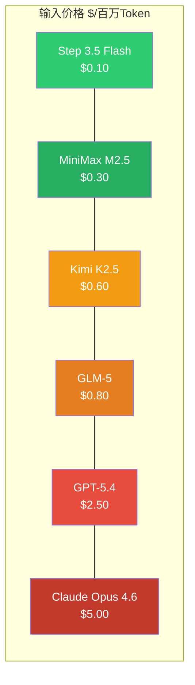
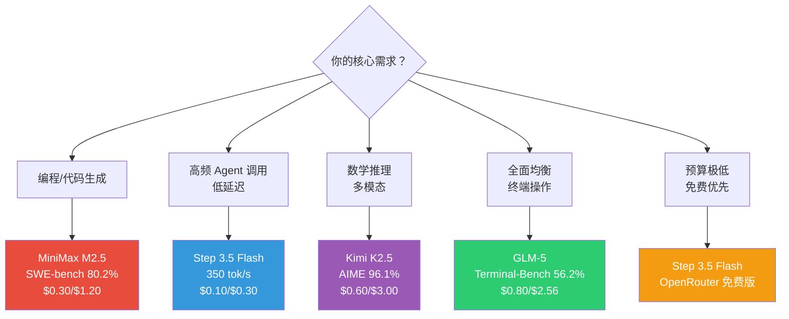
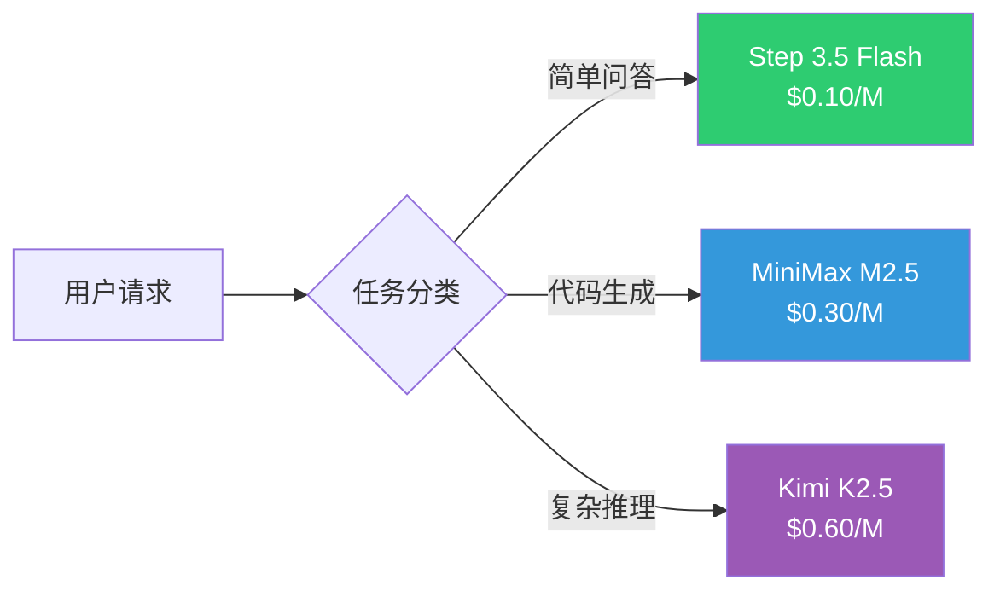

## 引言：历史性时刻

2026 年 2 月第三周，一个历史性的事件悄然发生：在全球最大的 LLM API 聚合平台 **OpenRouter** 上，**中国大模型的 Token 消耗量首次超越了美国**。

数据说话：
- 中国模型：**5.16 万亿 Token/周**
- 美国模型：**2.70 万亿 Token/周**
- Top 10 模型中，中国占 **6 席**，消耗量占比 **61%**

这不是靠补贴刷出来的数字——背后是**碾压级的性价比**：MiniMax M2.5 的编程能力接近 Claude Opus 4.6（80.2% vs 80.8%），价格却只有 **1/17**。

本文将深度横评四大霸榜模型，帮你找到最适合的国产大模型 API。

---

## 一、OpenRouter Top 5 全景

| 排名 | 模型 | 周 Token 消耗 | 开发商 | 国别 |
|------|------|-------------|--------|------|
| 1 | MiniMax M2.5 | ~3.07T | MiniMax | 🇨🇳 |
| 2 | Kimi K2.5 | ~1.21T | 月之暗面 | 🇨🇳 |
| 3 | GLM-5 | ~780B | 智谱 AI | 🇨🇳 |
| 4 | GPT-5.2 / Claude | — | OpenAI / Anthropic | 🇺🇸 |
| 5 | DeepSeek V3.2 | — | DeepSeek | 🇨🇳 |

> **为什么国产模型突然霸榜？** OpenRouter COO Chris Clark 确认：中国模型在**美国公司的 Agentic 工作流**中被大量使用——性能够用、价格碾压，是 Agent 场景的理性选择。

---

## 二、四大模型深度横评

### 核心参数对比

| 参数 | Step 3.5 Flash | MiniMax M2.5 | GLM-5 | Kimi K2.5 |
|------|---------------|-------------|-------|-----------|
| **开发商** | 阶跃星辰 | MiniMax | 智谱 AI | 月之暗面 |
| **总参数** | 196B | 230B | 744B | **1,040B** |
| **激活参数** | **11B** | **10B** | 40B | 32B |
| **架构** | MoE (288 专家, Top-8) | MoE + CISPO | MoE + 稀疏注意力 | MoE (384 专家, Top-8) |
| **上下文** | **256K** | 200K | 200K | **256K** |
| **推理速度** | **100-350 tok/s** | 50-100 tok/s | ~33 tok/s | ~33 tok/s |
| **开源协议** | Apache 2.0 | MIT | Open-weight | Modified MIT |

### 编程与推理能力

| 基准 | Step 3.5 Flash | MiniMax M2.5 | GLM-5 | Kimi K2.5 | Claude Opus 4.6 |
|------|---------------|-------------|-------|-----------|----------------|
| **SWE-bench Verified** | 74.4% | **80.2%** | 77.8% | 76.8% | 80.8% |
| **AIME 2025** | **97.3** | — | 84.0 | 96.1 | — |
| **Terminal-Bench 2.0** | 51.0 | — | **56.2** | 50.8 | — |
| **LiveCodeBench** | **86.4** | — | 52.0 | 85.0 | — |
| **GPQA Diamond** | — | — | 68.2 | **87.6** | 77.3 |

### 定价对比（每百万 Token）



| 模型 | 输入 | 输出 | 相比 Claude Opus 4.6 |
|------|------|------|---------------------|
| **Step 3.5 Flash** | **$0.10** | **$0.30** | 便宜 **50 倍** |
| **MiniMax M2.5** | $0.30 | $1.20 | 便宜 **17 倍** |
| **Kimi K2.5** | $0.60 | $3.00 | 便宜 **8 倍** |
| **GLM-5** | $0.80 | $2.56 | 便宜 **6 倍** |
| GPT-5.4 | $2.50 | $15.00 | 便宜 **2 倍** |
| Claude Opus 4.6 | $5.00 | $25.00 | 基准 |

---

## 三、逐模型深度解析

### 1. Step 3.5 Flash — 速度之王

**阶跃星辰**于 3 月 4 日完全开源（Apache 2.0），包括 Base 权重、Midtrain 权重和训练框架 **Steptron**。

**核心优势**：
- **极速推理**：100-350 tok/s，是其他模型的 3-10 倍
- **MTP-3**：一次前向传播预测 4 个 Token，效率倍增
- **仅 11B 激活参数**：以最小的计算消耗达到接近一线的性能
- **OpenRouter 上有免费版本**

**适用场景**：高频 Agent 调用、实时对话、需要低延迟的应用

**API 接入（OpenRouter）**：
```python
from openai import OpenAI

client = OpenAI(
    api_key="sk-or-v1-你的Key",
    base_url="https://openrouter.ai/api/v1"
)

response = client.chat.completions.create(
    model="stepfun/step-3.5-flash",  # 免费版加 :free
    messages=[{"role": "user", "content": "用 Python 实现快速排序"}]
)
print(response.choices[0].message.content)
```

**本地部署**：支持 vLLM、SGLang、llama.cpp，GGUF INT4 约需 120GB 显存。

---

### 2. MiniMax M2.5 — 编程之王

**MiniMax** 的 M2.5 是当前国产模型中**编程能力最强**的，SWE-bench Verified 80.2% 几乎追平 Claude Opus 4.6。

**核心优势**：
- **编程顶尖**：SWE-bench 80.2%，Multi-SWE-Bench 51.3%
- **MIT 开源**：完全自由商用
- **CISPO 算法**：独创的 MoE 训练策略
- **速度可选**：Lightning 版本 100 tok/s

**适用场景**：代码生成、代码审查、复杂编程任务

**API 接入（OpenRouter）**：
```python
response = client.chat.completions.create(
    model="minimax/minimax-m2.5",
    messages=[{"role": "user", "content": "重构这段代码，提升性能..."}]
)
```

**Ollama 云端代理**：
```bash
ollama run minimax-m2:cloud
```

> **注意**：这是通过 Ollama 的云端代理路由到 MiniMax API，不是真正的本地运行（230B 模型本地部署需要企业级硬件）。

---

### 3. GLM-5 — 全能选手

**智谱 AI** 的 GLM-5 是四大模型中参数量第二大的（744B/40B 激活），在多个维度均衡表现。

**核心优势**：
- **均衡全面**：编程、推理、知识问答都在一线水平
- **Slime 训练框架**：异步 Agent 强化学习
- **Terminal-Bench 领先**：56.2%，终端操作能力最强
- **NVIDIA NIM 免费可用**

**适用场景**：需要全面能力的通用场景、终端/命令行 Agent

**免费使用（NVIDIA NIM）**：
```python
from openai import OpenAI

client = OpenAI(
    api_key="nvapi-你的Key",
    base_url="https://integrate.api.nvidia.com/v1"
)

response = client.chat.completions.create(
    model="z-ai/glm-5",
    messages=[{"role": "user", "content": "分析这个系统架构的瓶颈..."}]
)
```

> 40 请求/分钟，无需信用卡。

---

### 4. Kimi K2.5 — 万亿参数怪兽

**月之暗面**的 Kimi K2.5 是四大模型中唯一突破 **1 万亿参数**的模型（1.04T/32B 激活）。

**核心优势**：
- **PARL Agent Swarm**：多 Agent 并行编排，BrowseComp 78.4%
- **数学推理顶尖**：AIME 2025 得分 96.1%
- **多模态原生**：MoonViT-3D 视觉编码器，OCRBench 92.3%
- **256K 超长上下文**

**适用场景**：数学推理、多模态任务、需要 Agent Swarm 的复杂任务

**API 接入**：
```python
client = OpenAI(
    api_key="sk-你的Key",
    base_url="https://api.moonshot.cn/v1"
)

response = client.chat.completions.create(
    model="kimi-k2.5",
    messages=[{"role": "user", "content": "解这道数学题..."}]
)
```

> **注意**：Kimi K2.5 每个任务生成的输出 Token 量约为其他模型的 **6 倍**（89M vs 14M），实际成本可能高于表面价格。

---

## 四、选型决策树



### 一句话选型

| 场景 | 首选 | 理由 |
|------|------|------|
| 日常编程辅助 | **MiniMax M2.5** | 编程最强 + 价格合理 |
| Agent 高频调用 | **Step 3.5 Flash** | 最快 + 最便宜 |
| 数学/科研推理 | **Kimi K2.5** | AIME 96.1% |
| 全面通用 | **GLM-5** | 各项均衡 |
| 零预算体验 | **Step 3.5 Flash:free** | OpenRouter 免费 |
| 追求极致编程 | **Claude Opus 4.6** | SWE-bench 80.8%（贵 17 倍） |

---

## 五、免费 & 低成本 API 全攻略

### 完全免费方案

| 方案 | 可用模型 | 限制 |
|------|----------|------|
| OpenRouter Free | Step 3.5 Flash, GLM-4.5 Air 等 | 限流 |
| NVIDIA NIM | GLM-5, Step 3.5 Flash | 40 请求/分钟 |

### 超低成本方案

| 方案 | 价格 | 包含模型 | 适合 |
|------|------|----------|------|
| **阿里云百炼 CodingPlan** | 首月 **7.9 元** | Qwen3.5-Plus, Kimi-K2.5, GLM-4.7 等 | 轻度使用/评估 |
| **火山方舟** | 首月 ~9 元 | Doubao, GLM, DeepSeek, Kimi | 字节生态用户 |
| **OpenRouter 按量付费** | 按 Token 计费 | 全部模型 | 灵活用量 |

### OpenRouter 统一接入教程

一次配置，随时切换任意模型：

```python
from openai import OpenAI

# 统一接入点
client = OpenAI(
    api_key="sk-or-v1-你的OpenRouter密钥",
    base_url="https://openrouter.ai/api/v1"
)

# 切换模型只需改 model 参数
models = {
    "speed":   "stepfun/step-3.5-flash",     # 最快
    "coding":  "minimax/minimax-m2.5",        # 编程最强
    "general": "z-ai/glm-5",                  # 全能
    "math":    "moonshotai/kimi-k2.5",        # 数学最强
    "free":    "stepfun/step-3.5-flash:free", # 免费
}

def ask(question: str, mode: str = "coding") -> str:
    response = client.chat.completions.create(
        model=models[mode],
        messages=[{"role": "user", "content": question}]
    )
    return response.choices[0].message.content

# 使用示例
print(ask("用 Rust 实现一个 HTTP 服务器", mode="coding"))
print(ask("证明 e 是无理数", mode="math"))
print(ask("今天的新闻摘要", mode="free"))
```

### 接入 Claude Code / Cline

在 Claude Code 或 Cline 中使用国产模型：

```bash
# 环境变量
export OPENAI_API_KEY="sk-or-v1-你的Key"
export OPENAI_BASE_URL="https://openrouter.ai/api/v1"

# 在 Cline 设置中选择 OpenRouter provider
# 模型填写 minimax/minimax-m2.5
```

---

## 六、成本优化策略

### 1. 分层调用

不同任务用不同模型，而不是一个模型打天下：



### 2. 缓存策略

- 使用 Prompt Caching（OpenRouter 支持）
- 高频查询结果本地缓存
- 相似查询合并处理

### 3. 成本对比计算

假设月均消耗 **1 亿 Token**（中型项目）：

| 模型 | 月成本（输入+输出） | 相比 Claude |
|------|---------------------|------------|
| Step 3.5 Flash | **~$40** | 省 $2,960 |
| MiniMax M2.5 | **~$150** | 省 $2,850 |
| GLM-5 | **~$336** | 省 $2,664 |
| Claude Opus 4.6 | **~$3,000** | 基准 |

> **结论**：同样的任务量，用 Step 3.5 Flash 可以节省 **98.7%** 的成本。

---

## 七、注意事项

### 1. OpenRouter 不代表全局

OpenRouter 主要服务独立开发者和小团队。Google 月处理 980T Token，是 OpenRouter 一周总量的百倍。中国模型在独立开发者市场霸榜，但企业市场格局不同。

### 2. Kimi K2.5 的隐性成本

Kimi K2.5 每个任务生成的 Token 量约为其他模型的 6 倍。**表面价格低不等于实际成本低**，务必按实际任务消耗计算。

### 3. 数据安全考量

使用国产模型 API 时，数据会经过模型提供商的服务器。敏感项目建议：
- 选择支持本地部署的模型（Step 3.5 Flash、MiniMax M2.5 均开源）
- 使用 NVIDIA NIM 等中立平台
- 关注各平台的数据处理协议

### 4. 模型迭代速度

国产模型迭代极快，本文数据基于 2026 年 3 月。建议定期检查各平台最新基准和定价。

---

## 八、行业展望

国产大模型霸榜 OpenRouter 背后是一个明确的趋势：**AI 应用层的竞争正在从"谁的模型最强"转向"谁的性价比最高"**。

- **MoE 架构成为主流**：四大模型全部采用 MoE，用 10-40B 激活参数达到 200B+ 密集模型的效果
- **开源加速**：Step 3.5 Flash（Apache 2.0）、MiniMax M2.5（MIT）的开源让开发者可以自由部署
- **Agent 场景驱动**：高频调用 + 低延迟 + 低成本 = 国产模型的天然优势
- **平台竞争白热化**：阿里云百炼、火山方舟、OpenRouter 争抢开发者，补贴力度空前

**对开发者的建议**：现在是接入国产模型的最佳时机——性能接近一线，价格低一个数量级，开源生态成熟，免费额度充足。

---

## 延伸阅读

- [GPT-5.4 深度解析](/posts/gpt-5-4-complete-guide/) — 国际竞品的最新能力评测
- [DeepSeek 完全指南](/posts/deepseek-complete-guide/) — 另一个霸榜的国产模型
- [Claude Code 终极指南](/posts/claude-code-tips/) — 编程体验最佳的 AI 工具
- [MCP 协议完全指南](/posts/mcp-protocol-guide/) — 让大模型调用外部工具
- [AI Agent 赚钱变现：9 种已验证的方法](/posts/ai-agent-monetization/) — 用低成本 API 构建变现项目
