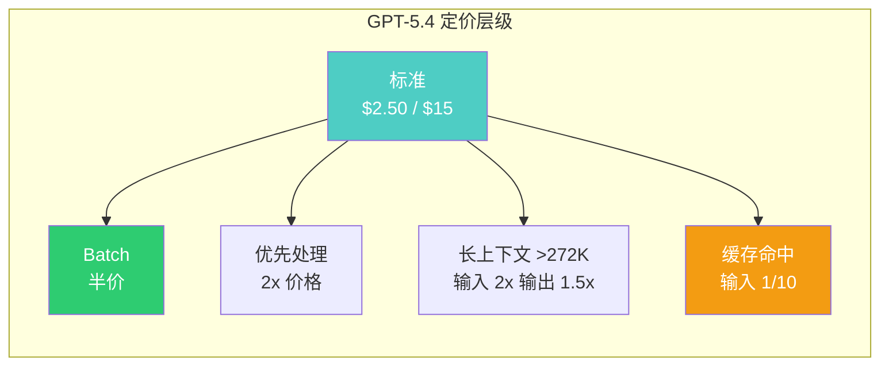
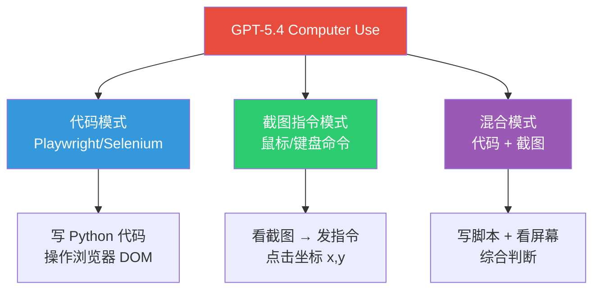
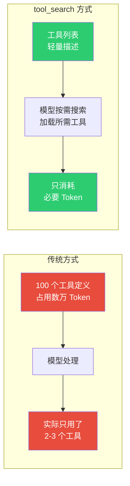
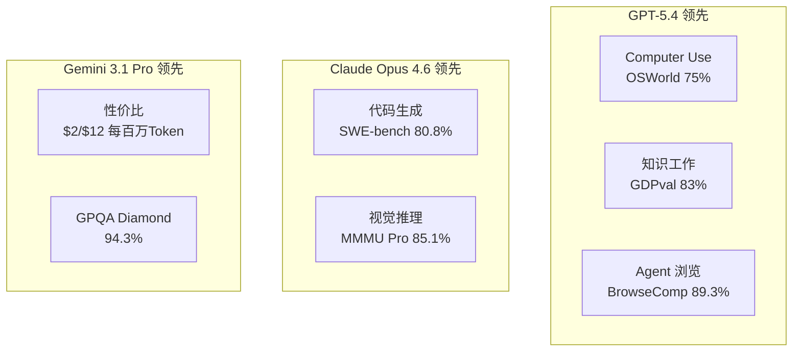
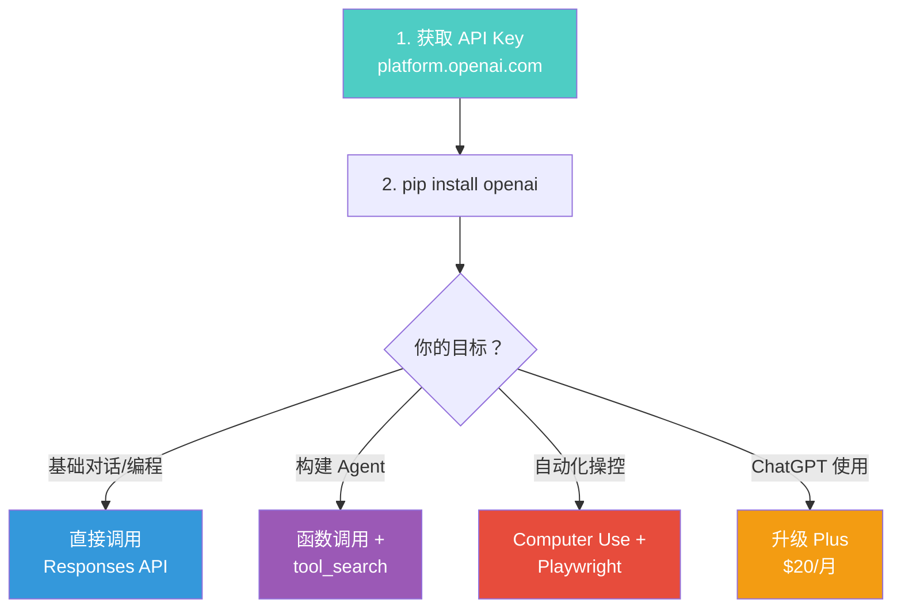

## GPT-5.4 来了：OpenAI 最强通用模型

2026 年 3 月 5 日，OpenAI 发布了 **GPT-5.4**——这不是一次小幅迭代，而是一次能力跃迁：

- **首个原生 Computer Use 模型**：能看屏幕、点鼠标、打字，超越人类水平
- **105 万 Token 上下文窗口**：一次对话可以处理整本书
- **tool_search 动态工具加载**：构建大规模 AI Agent 的杀手级特性
- **幻觉率降低 33%**：更可靠的知识工作伙伴

本文将从开发者视角，完整拆解 GPT-5.4 的核心能力，并提供可直接运行的代码示例。

---

## 一、GPT-5.4 核心参数一览

### 模型家族

| 模型 | API ID | 定位 | 适用场景 |
|------|--------|------|----------|
| GPT-5.4 | `gpt-5.4` | 旗舰推理模型 | 日常专业工作、编程、Agent |
| GPT-5.4 Thinking | 同上（ChatGPT 界面名称） | 带思考过程的交互版本 | ChatGPT 用户 |
| GPT-5.4 Pro | `gpt-5.4-pro` | 最大算力版本 | 顶级科研、复杂推理 |

### 关键参数

| 参数 | GPT-5.4 | GPT-5.4 Pro |
|------|---------|-------------|
| 上下文窗口 | **105 万 Token** | **105 万 Token** |
| 最大输出 | 128,000 Token | 128,000 Token |
| 知识截止 | 2025 年 8 月 31 日 | 2025 年 8 月 31 日 |
| 标准上下文 | 272K（超出部分输入 2 倍价格） | 272K |

### 定价

| 模型 | 输入（/百万 Token） | 缓存输入 | 输出（/百万 Token） |
|------|---------------------|----------|---------------------|
| GPT-5.4 | $2.50 | $0.25 | $15.00 |
| GPT-5.4 Pro | $30.00 | — | $180.00 |

**省钱技巧**：
- **Batch/Flex 模式**：标准价格的 **50%**
- **缓存命中**：输入价格降至 **1/10**（$0.25/百万）
- **超长上下文（>272K Token）**：输入 2 倍、输出 1.5 倍



---

## 二、Computer Use：AI 操控你的电脑

这是 GPT-5.4 最震撼的能力——**不再只是对话，而是直接操作电脑界面**。

### 三种模式



#### 模式 1：Playwright 代码模式

GPT-5.4 直接编写并执行 Playwright 自动化代码：

```python
from playwright.sync_api import sync_playwright

with sync_playwright() as p:
    browser = p.chromium.launch(headless=False)
    page = browser.new_page()
    page.goto("https://example.com")

    # GPT-5.4 生成的自动化代码
    page.click("text=登录")
    page.fill("#username", "your_username")
    page.fill("#password", "your_password")
    page.click("button[type='submit']")

    # 截图供模型分析
    screenshot = page.screenshot()
```

#### 模式 2：截图指令模式

模型直接分析屏幕截图，发出鼠标/键盘指令——不需要编写代码：

```json
{
  "action": "click",
  "coordinate": [450, 320],
  "description": "点击'提交'按钮"
}
```

#### 模式 3：混合模式（推荐）

结合代码和截图的优势，是实际应用中最可靠的方案。

### 图像输入精度提升

| 精度等级 | 分辨率上限 | 适用场景 |
|----------|-----------|----------|
| `original`（**新增**） | 1024 万像素 / 6000px | Computer Use、细节文档 |
| `high` | 256 万像素 / 2048px | 一般图片理解 |

### 基准测试：超越人类

| 基准 | GPT-5.2 | GPT-5.4 | 人类水平 |
|------|---------|---------|----------|
| OSWorld-Verified（桌面操控） | 47.3% | **75.0%** | 72.4% |
| WebArena-Verified（浏览器） | 65.4% | **67.3%** | — |
| Online-Mind2Web（截图理解） | — | **92.8%** | — |

**GPT-5.4 在桌面操控任务上首次超越了人类基准**（75% vs 72.4%）。

---

## 三、tool_search：大规模 Agent 的杀手级特性

### 问题：传统方式的 Token 浪费

构建 AI Agent 时，通常需要定义大量工具。传统做法是把所有工具定义都放在 prompt 里：



### 实测效果

在 Scale MCP Atlas 基准（36 个 MCP 服务器、250 个任务）上：
- **Token 消耗减少 47%**
- 准确率保持不变

### 两种模式

#### 1. 托管搜索（Hosted）

OpenAI 服务端自动搜索并加载工具：

```python
from openai import OpenAI
client = OpenAI()

# 定义工具命名空间，部分工具延迟加载
crm_namespace = {
    "type": "namespace",
    "name": "crm",
    "description": "CRM 客户管理工具集",
    "tools": [
        {
            "type": "function",
            "name": "get_customer",
            "description": "按 ID 查询客户信息",
            "parameters": {
                "type": "object",
                "properties": {
                    "customer_id": {"type": "string"}
                },
                "required": ["customer_id"],
                "additionalProperties": False,
            },
        },
        {
            "type": "function",
            "name": "list_orders",
            "description": "查询客户的所有订单",
            "defer_loading": True,  # 关键：延迟加载
            "parameters": {
                "type": "object",
                "properties": {
                    "customer_id": {"type": "string"}
                },
                "required": ["customer_id"],
                "additionalProperties": False,
            },
        },
    ],
}

response = client.responses.create(
    model="gpt-5.4",
    input="查询客户 CUST-12345 的所有订单",
    tools=[
        crm_namespace,
        {"type": "tool_search"},  # 启用 tool_search
    ],
    parallel_tool_calls=False,
)
```

#### 2. 客户端搜索（Client-Executed）

你自己实现工具搜索逻辑（适合自定义工具库）：

```python
# 第一轮：模型请求搜索工具
first_response = client.responses.create(
    model="gpt-5.4",
    input="查找物流追踪工具，然后查询订单 42 的状态",
    tools=[{
        "type": "tool_search",
        "execution": "client",
        "description": "搜索项目可用的工具",
        "parameters": {
            "type": "object",
            "properties": {"goal": {"type": "string"}},
            "required": ["goal"],
            "additionalProperties": False,
        },
    }],
)

# 提取搜索请求
search_call = next(
    item for item in first_response.output
    if item.type == "tool_search_call"
)

# 第二轮：返回匹配的工具
second_response = client.responses.create(
    model="gpt-5.4",
    input=[
        *first_response.output,
        {
            "type": "tool_search_output",
            "execution": "client",
            "call_id": search_call.call_id,
            "status": "completed",
            "tools": [loaded_shipping_tool],  # 你的工具定义
        },
    ],
)
```

### 最佳实践

- 每个命名空间控制在 **10 个函数以内**
- 为每个命名空间写清晰的 `description`
- 高频工具保持即时加载，低频工具设置 `defer_loading: True`

---

## 四、API 实战速查

### 安装与初始化

```bash
pip install openai
```

```python
from openai import OpenAI
client = OpenAI()  # 自动读取 OPENAI_API_KEY 环境变量
```

### 基础调用

```python
response = client.responses.create(
    model="gpt-5.4",
    input="用 Python 实现一个快速排序算法",
)
print(response.output_text)
```

### 调节推理强度

```python
# 简单任务用 medium，复杂推理用 xhigh
response = client.responses.create(
    model="gpt-5.4",
    reasoning={"effort": "high"},
    input="证明根号 2 是无理数",
)
```

### 函数调用

```python
response = client.responses.create(
    model="gpt-5.4",
    input="今天北京天气怎么样？",
    tools=[{
        "type": "function",
        "name": "get_weather",
        "description": "获取指定城市的当前天气",
        "parameters": {
            "type": "object",
            "properties": {
                "city": {"type": "string", "description": "城市名称"},
            },
            "required": ["city"],
            "additionalProperties": False,
        },
    }],
)
```

### Web 搜索

```python
response = client.responses.create(
    model="gpt-5.4",
    tools=[{"type": "web_search"}],
    input="2026 年 3 月最新的 AI 行业动态",
)
print(response.output_text)
```

### API 端点支持矩阵

| 端点 | GPT-5.4 | GPT-5.4 Pro |
|------|---------|-------------|
| Chat Completions | ✅ | ✅ |
| Responses | ✅ | ✅（**必须**） |
| Batch | ✅ | ✅ |
| Realtime | ✅ | ✅ |
| Assistants | ✅ | ✅ |

| 功能 | GPT-5.4 | GPT-5.4 Pro |
|------|---------|-------------|
| 函数调用 | ✅ | ✅ |
| Web 搜索 | ✅ | ✅ |
| Computer Use | ✅ | ✅ |
| Tool Search | ✅ | ✅ |
| MCP | ✅ | ✅ |
| 图片生成 | ✅ | ✅ |

---

## 五、ChatGPT 用户怎么用？

| 套餐 | GPT-5.4 Thinking | GPT-5.4 Pro | 限制 |
|------|-------------------|-------------|------|
| Free | ❌ | ❌ | — |
| Plus（$20/月） | ✅ | ❌ | 3000 条/周 |
| Team | ✅ | ❌ | — |
| Pro（$200/月） | ✅ | ✅ | 无限制 |
| Enterprise | ✅ | ✅ | 管理员启用 |

**注意**：GPT-5.2 Thinking 已移入"Legacy Models"，将于 **2026 年 6 月 5 日**退役。

### 第三方集成

- **GitHub Copilot**：GPT-5.4 已在 Copilot Pro/Pro+/Business/Enterprise 中可用，支持 VS Code v1.104.1+、JetBrains、Xcode
- **Codex**：支持实验性 100 万 Token 上下文

---

## 六、基准跑分全景

### 知识工作与推理

| 基准 | GPT-5.2 | GPT-5.4 | GPT-5.4 Pro |
|------|---------|---------|-------------|
| GDPval（知识工作，44 职业） | 70.9% | **83.0%** | — |
| IB 建模任务 | 68.4% | **87.3%** | — |
| 幻觉减少 | 基准 | **-33%** | — |
| GPQA Diamond | 92.4% | 92.8% | **94.4%** |
| Humanity's Last Exam | 45.5% | 52.1% | **58.7%** |

### 编程

| 基准 | GPT-5.2 | GPT-5.3 Codex | GPT-5.4 |
|------|---------|---------------|---------|
| SWE-Bench Pro | 55.6% | 56.8% | **57.7%** |
| Terminal-Bench 2.0 | 62.2% | **77.3%** | 75.1% |

### 数学与科研

| 基准 | GPT-5.4 | GPT-5.4 Pro |
|------|---------|-------------|
| FrontierMath Tier 1-3 | 47.6% | **50.0%** |
| FrontierMath Tier 4 | 27.1% | **38.0%** |
| ARC-AGI-1 Verified | 93.7% | **94.5%** |
| ARC-AGI-2 Verified | 73.3% | **83.3%** |

### Agent 与工具使用

| 基准 | GPT-5.2 | GPT-5.4 | GPT-5.4 Pro |
|------|---------|---------|-------------|
| Toolathlon | 45.7% | **54.6%** | — |
| MCP Atlas | 60.6% | **67.2%** | — |
| BrowseComp | 65.8% | 82.7% | **89.3%** |

---

## 七、GPT-5.4 vs Claude Opus 4.6 vs Gemini 3.1 Pro

这是 2026 年 3 月最激烈的三强对决：

### 能力对比



### 定价对比

| 模型 | 输入/百万 Token | 输出/百万 Token | 上下文窗口 |
|------|----------------|----------------|-----------|
| GPT-5.4 | $2.50 | $15.00 | **105 万** |
| GPT-5.4 Pro | $30.00 | $180.00 | **105 万** |
| Claude Opus 4.6 | $5.00 | $25.00 | 20 万（100 万 Beta） |
| Gemini 3.1 Pro | **$2.00** | **$12.00** | — |

### 怎么选？

| 场景 | 推荐模型 | 原因 |
|------|----------|------|
| 自动化操控电脑/浏览器 | **GPT-5.4** | Computer Use 最强（OSWorld 75%） |
| 编程/代码生成 | **Claude Opus 4.6** | SWE-bench 80.8% 碾压级领先 |
| 性价比优先 | **Gemini 3.1 Pro** | 最低价格，GPQA 接近最高 |
| 大规模 Agent 系统 | **GPT-5.4** | tool_search + 105 万上下文 |
| 科研推理/数学 | **GPT-5.4 Pro** | ARC-AGI-2 83.3%、FrontierMath 领先 |
| 日常编程辅助 | **Claude Code** | 开发体验最流畅 |

> **结论**：2026 年 3 月是 AI 模型竞争最激烈的时刻——没有绝对赢家。GPT-5.4 在 Agent 能力上领先，Claude 在编程上更强，Gemini 在性价比上无敌。**根据你的场景选择，而不是追最高分**。

---

## 八、快速上手路线



### 5 分钟快速体验

```python
# 1. 安装
# pip install openai

# 2. 设置环境变量
# export OPENAI_API_KEY="sk-..."

# 3. 运行
from openai import OpenAI
client = OpenAI()

# 基础对话
response = client.responses.create(
    model="gpt-5.4",
    input="用一段话解释 GPT-5.4 的 Computer Use 功能",
)
print(response.output_text)

# 带 Web 搜索
response = client.responses.create(
    model="gpt-5.4",
    tools=[{"type": "web_search"}],
    input="搜索今天最新的 AI 新闻，用中文总结",
)
print(response.output_text)
```

---

## 九、需要注意的事项

### 1. 安全性

Computer Use 意味着 AI 可以操控你的电脑。务必注意：
- 使用**沙箱环境**运行 Computer Use 任务
- 配置**确认策略**（confirmation policies）控制风险操作
- 不要在生产环境中给予无限制的桌面访问权限

### 2. 成本控制

- 超过 272K Token 的对话，价格翻倍
- Pro 版本价格是标准版的 **12 倍**，仅在需要顶级推理时使用
- 善用缓存（Cached Input 价格仅 1/10）和 Batch 模式（半价）

### 3. GPT-5.2 迁移

- GPT-5.2 Thinking 将于 2026 年 6 月 5 日退役
- 建议尽早测试 GPT-5.4，迁移现有应用
- API ID 从 `gpt-5.2` 改为 `gpt-5.4` 即可

---

## 延伸阅读

- [Claude Code 终极指南：从入门到精通](/posts/claude-code-tips/) — GPT-5.4 最强竞品的深度教程
- [Cursor vs Claude Code vs Copilot vs Windsurf 全面对比](/posts/cursor-vs-claude-code-vs-copilot-vs-windsurf/) — AI 编程工具横评
- [MCP 协议完全指南](/posts/mcp-protocol-guide/) — GPT-5.4 也支持的 MCP 协议详解
- [2026 年 10 个最值得用的 AI 工具](/posts/top-10-ai-tools-2026/) — 更多 AI 工具推荐
