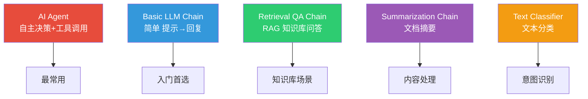
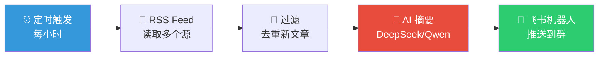
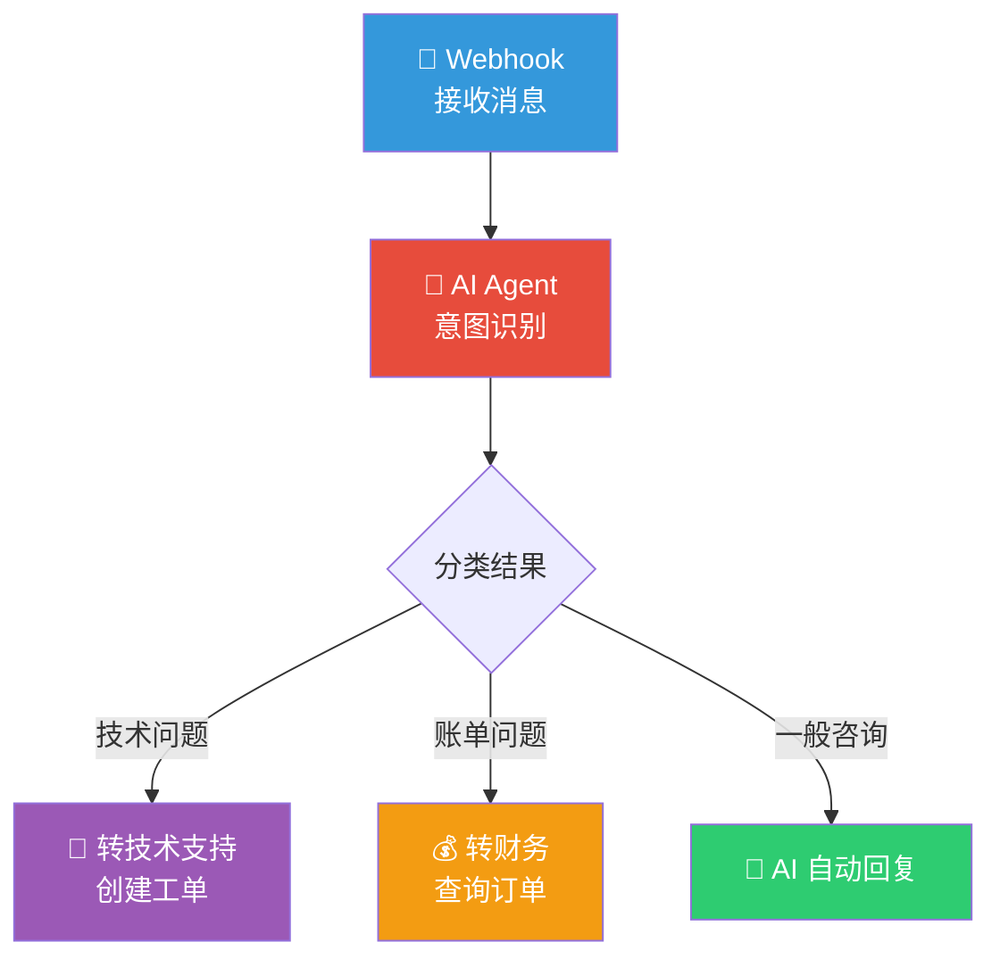
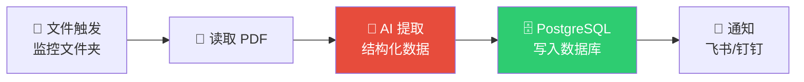
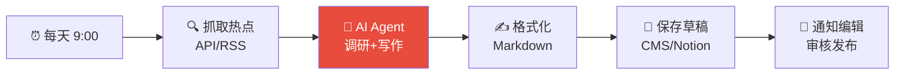
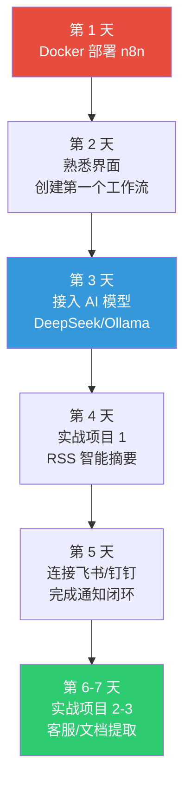

## 为什么你需要 n8n？

想象这样的场景：
- 每天自动抓取 10 个 RSS 源 → AI 总结为中文摘要 → 推送到飞书群
- 收到客户消息 → AI 自动分类意图 → 技术问题转工程师、账单问题转财务
- 新 PDF 上传到文件夹 → AI 提取发票信息 → 自动录入数据库

这些都不需要写一行代码——**n8n** 让你用拖拽节点的方式，把 AI 模型和 400+ 服务串成自动化流水线。

| 特点 | 详情 |
|------|------|
| GitHub Stars | **70,000+** |
| 内置集成 | **400+** |
| 自建部署 | **完全免费**，无限制 |
| AI 能力 | 内置 **LangChain** 节点 |
| 代码支持 | JavaScript + Python |

---

## 一、5 分钟 Docker 部署

### 快速体验（单命令启动）

```bash
docker volume create n8n_data

docker run -d \
  --name n8n \
  -p 5678:5678 \
  -e GENERIC_TIMEZONE="Asia/Shanghai" \
  -e TZ="Asia/Shanghai" \
  -v n8n_data:/home/node/.n8n \
  docker.n8n.io/n8nio/n8n
```

打开 `http://localhost:5678`，注册账号即可使用。

### 生产级部署（Docker Compose + PostgreSQL + Caddy）

创建项目目录：

```bash
mkdir -p ~/n8n && cd ~/n8n
```

**docker-compose.yml**：

```yaml
version: "3.8"

services:
  postgres:
    image: postgres:16-alpine
    restart: unless-stopped
    environment:
      POSTGRES_USER: n8n
      POSTGRES_PASSWORD: ${POSTGRES_PASSWORD}
      POSTGRES_DB: n8n
    volumes:
      - postgres_data:/var/lib/postgresql/data
    healthcheck:
      test: ["CMD-SHELL", "pg_isready -U n8n"]
      interval: 10s
      timeout: 5s
      retries: 5

  n8n:
    image: docker.n8n.io/n8nio/n8n
    restart: unless-stopped
    depends_on:
      postgres:
        condition: service_healthy
    environment:
      DB_TYPE: postgresdb
      DB_POSTGRESDB_HOST: postgres
      DB_POSTGRESDB_PORT: 5432
      DB_POSTGRESDB_DATABASE: n8n
      DB_POSTGRESDB_USER: n8n
      DB_POSTGRESDB_PASSWORD: ${POSTGRES_PASSWORD}
      N8N_HOST: ${N8N_HOST}
      N8N_PORT: 5678
      N8N_PROTOCOL: https
      WEBHOOK_URL: https://${N8N_HOST}/
      N8N_ENCRYPTION_KEY: ${N8N_ENCRYPTION_KEY}
      GENERIC_TIMEZONE: Asia/Shanghai
      TZ: Asia/Shanghai
      EXECUTIONS_DATA_PRUNE: "true"
      EXECUTIONS_DATA_MAX_AGE: 168
    volumes:
      - n8n_data:/home/node/.n8n
    ports:
      - "5678:5678"

  caddy:
    image: caddy:2-alpine
    restart: unless-stopped
    ports:
      - "80:80"
      - "443:443"
    volumes:
      - ./Caddyfile:/etc/caddy/Caddyfile:ro
      - caddy_data:/data
    depends_on:
      - n8n

volumes:
  postgres_data:
  n8n_data:
  caddy_data:
```

**.env**：

```bash
POSTGRES_PASSWORD=用openssl生成一个强密码
N8N_HOST=n8n.yourdomain.com
N8N_ENCRYPTION_KEY=用openssl_rand_hex_32生成
```

**Caddyfile**（自动 HTTPS）：

```
n8n.yourdomain.com {
    reverse_proxy n8n:5678 {
        flush_interval -1
    }
}
```

启动：

```bash
docker compose up -d
```

> **重要**：`N8N_ENCRYPTION_KEY` 用于加密所有存储的凭证。**丢失即永久无法解密**，务必备份。

### 硬件要求

| 用途 | CPU | 内存 | 存储 | 月成本 |
|------|-----|------|------|--------|
| 个人/测试 | 1 核 | 2GB | 20GB | ~$5 |
| 生产环境 | 2 核 | 4GB | 40GB | ~$15 |

---

## 二、n8n AI 节点全景

n8n 的 AI 能力基于 **LangChain**，通过"主节点 + 子节点"的组合方式构建 AI 工作流。

### AI 主节点



### 支持的 LLM 模型

| 节点名称 | 提供商 | 是否需要翻墙 |
|----------|--------|-------------|
| **DeepSeek Chat Model** | DeepSeek | 否 |
| **OpenRouter Chat Model** | OpenRouter | 否 |
| **Ollama Chat Model** | 本地模型 | 否 |
| OpenAI Chat Model | OpenAI | 是 |
| Anthropic Chat Model | Anthropic | 是 |
| Google Gemini Chat Model | Google | 是 |
| AWS Bedrock Chat Model | AWS | 视区域 |
| Mistral Cloud Chat Model | Mistral | 是 |
| Hugging Face Inference | HuggingFace | 是 |

**国产模型接入方案**：

| 模型 | 接入方式 |
|------|----------|
| DeepSeek | **原生节点**（直接用） |
| Qwen / 通义千问 | OpenRouter 节点 或 OpenAI 节点改 Base URL |
| GLM / 智谱 | OpenRouter 节点 或 HTTP Request |
| Kimi / 月之暗面 | OpenRouter 节点 或 HTTP Request |
| MiniMax M2.5 | OpenRouter 节点 |
| 本地开源模型 | **Ollama 节点** |

### AI Agent 子节点

| 类别 | 子节点 | 用途 |
|------|--------|------|
| **工具** | Calculator, Code Tool, SerpAPI, Wikipedia, Workflow Tool | Agent 可调用的外部能力 |
| **记忆** | Simple Memory, Redis Memory, Postgres Memory | 对话历史持久化 |
| **向量库** | PGVector, Pinecone, Qdrant, Supabase | RAG 知识库存储 |
| **嵌入** | OpenAI, Ollama, Cohere, HuggingFace Embeddings | 文本向量化 |
| **文档** | Document Loader, Text Splitter | 文档处理 |

---

## 三、4 个实战项目

### 项目 1：RSS 智能摘要 → 飞书推送

**场景**：每小时自动抓取 AI 新闻，AI 总结为中文摘要，推送到飞书群。



**节点配置**：

1. **Schedule Trigger**：每 60 分钟执行一次
2. **RSS Feed Read**：输入 RSS 地址（如 TechCrunch、36kr 等）
3. **IF Node**：只保留最近 1 小时的新文章
4. **Basic LLM Chain + DeepSeek Chat Model**：

   System Prompt：
   ```
   你是一个专业的科技新闻编辑。请将以下英文文章总结为中文，要求：
   1. 标题翻译（保留关键术语英文）
   2. 100字以内的核心摘要
   3. 3个关键要点
   4. 输出格式为 Markdown
   ```

5. **HTTP Request**（飞书 Webhook）：
   ```
   POST https://open.feishu.cn/open-apis/bot/v2/hook/YOUR_HOOK_ID
   Content-Type: application/json

   {
     "msg_type": "interactive",
     "card": {
       "header": {"title": {"content": "📰 AI 新闻速递"}},
       "elements": [{"tag": "markdown", "content": "{{AI摘要输出}}"}]
     }
   }
   ```

---

### 项目 2：AI 智能客服分流

**场景**：收到客户消息，AI 自动识别意图并路由到对应处理流程。



**节点配置**：

1. **Webhook Trigger**：`POST /webhook/customer-service`
2. **AI Agent**：
   - 子节点：DeepSeek Chat Model + Simple Memory + Code Tool
   - System Prompt：
   ```
   你是客服助手。根据用户消息判断意图并回复。
   意图分类：technical（技术问题）、billing（账单问题）、general（一般咨询）

   对于 general 类问题，直接给出友好的回复。
   对于 technical 和 billing，说明将转接专人处理。

   输出 JSON：{"intent": "...", "reply": "...", "summary": "..."}
   ```
3. **Switch Node**：根据 `intent` 字段路由
4. **各分支**：HTTP Request 调用对应系统的 API

---

### 项目 3：PDF 发票自动提取入库

**场景**：上传 PDF 发票 → AI 提取关键信息 → 自动存入数据库。



**AI 提取 Prompt**：
```
从以下发票内容中提取信息，返回 JSON 格式：
{
  "invoice_number": "发票号码",
  "date": "开票日期 (YYYY-MM-DD)",
  "seller": "销售方名称",
  "buyer": "购买方名称",
  "total_amount": 金额数字,
  "tax_amount": 税额数字,
  "items": [{"name": "项目名", "quantity": 数量, "unit_price": 单价}]
}
```

使用 **Structured Output Parser** 确保 AI 输出严格符合 JSON 格式。

---

### 项目 4：AI 内容日更工作流

**场景**：每天自动生成一篇 AI 领域的中文文章草稿。



**AI Agent 配置**：
- **模型**：DeepSeek 或 OpenRouter（接入国产模型）
- **工具**：SerpAPI（搜索最新信息）、Code Tool（格式化输出）
- **记忆**：Redis Memory（记住已写过的话题避免重复）

---

## 四、连接中国服务

### 飞书（Lark）

安装社区节点：

Settings → Community Nodes → Install：
```
n8n-nodes-feishu-lite
```

支持：机器人消息、多维表格、文档操作、Webhook 触发。

也可使用 **HTTP Request** 节点 + 飞书 Webhook URL 实现轻量集成。

### 钉钉（DingTalk）

目前无专用节点，使用 HTTP Request 调用 Webhook 机器人：

```json
POST https://oapi.dingtalk.com/robot/send?access_token=YOUR_TOKEN

{
  "msgtype": "markdown",
  "markdown": {
    "title": "AI 通知",
    "text": "### 新消息\n> AI 摘要内容..."
  }
}
```

### 企业微信（WeCom）

安装社区节点：
```
n8n-nodes-wechat-work
```

支持：群聊管理、消息发送、通讯录管理、客户关系管理。

### 集成状态总览

| 服务 | 内置节点 | 社区节点 | HTTP 方案 |
|------|----------|----------|-----------|
| 飞书 / Lark | ❌ | ✅ 多个可选 | ✅ |
| 钉钉 | ❌ | ❌ | ✅ Webhook |
| 企业微信 | ❌ | ✅ | ✅ |
| 微信公众号 | ❌ | ✅ | ✅ |
| DeepSeek | **✅ 原生** | — | — |

---

## 五、n8n vs Zapier vs Make

| 特性 | n8n | Zapier | Make |
|------|-----|--------|------|
| **自建部署** | ✅ 免费无限制 | ❌ | ❌ |
| **计费方式** | 按执行次数 | **按步骤计费** | 按操作计费 |
| **代码支持** | JS + Python | 有限 | 有限 |
| **AI 能力** | **内置 LangChain** | 基础 AI 步骤 | 基础 AI 步骤 |
| **数据控制** | 完全自主 | 云端 | 云端 |
| **国产服务** | 社区节点 | 极少 | 极少 |
| **入门价格** | **免费** | $19.99/月 | $9/月 |
| **适合** | 技术团队 | 非技术用户 | 中间地带 |

**核心优势**：n8n 一次执行内无论包含多少步骤都只算 1 次，而 Zapier 的每个步骤都单独计费。一个 10 步工作流在 Zapier 上消耗 10 个任务，在 n8n 上只消耗 1 次执行。

---

## 六、进阶玩法

### RAG 知识库问答

```
文档上传 → Text Splitter → Ollama Embeddings → PGVector 存储
                                                      ↓
用户提问 → Vector Store Retriever → Retrieval QA Chain → 回复
```

用 PGVector（PostgreSQL 扩展）+ Ollama 本地嵌入模型，零成本搭建私有知识库。

### Workflow Tool：工作流嵌套

AI Agent 可以通过 **Workflow Tool** 子节点调用其他工作流——相当于给 Agent 加了"技能"：

- 工作流 A：查询数据库
- 工作流 B：发送通知
- 工作流 C：生成报告
- **AI Agent**：根据用户请求自动选择调用哪个工作流

### MCP 集成

社区节点 `n8n-nodes-mcp` 支持 MCP 协议，让 n8n 可以：
- 作为 **MCP Server** 被 Claude Desktop、Cursor 等调用
- 作为 **MCP Client** 连接到外部 MCP 服务器

---

## 七、最佳实践

### 1. 错误处理

每个关键节点后加 **Error Trigger** 节点，失败时发送通知而不是静默崩溃。

### 2. 凭证管理

- 所有 API Key 通过 n8n 的凭证管理器存储（自动加密）
- 不要在节点配置中硬编码密钥
- 定期轮换 API Key

### 3. 执行效率

- 对大量数据使用 **Split In Batches** 节点分批处理
- AI 调用使用 **Wait** 节点控制速率，避免触发 API 限流
- 启用 `EXECUTIONS_DATA_PRUNE` 自动清理历史执行数据

### 4. 备份策略

```bash
# 数据库备份
docker exec n8n-postgres pg_dump -U n8n n8n | gzip > backup.sql.gz

# 工作流导出
# 在 n8n 界面: Settings → Export all workflows
```

---

## 八、快速上手路线



**第一步推荐**：先用快速部署命令启动 n8n，创建一个"Schedule Trigger → HTTP Request → 飞书 Webhook"的简单工作流跑通全流程，再逐步加入 AI 节点。

---

## 延伸阅读

- [国产大模型 API 选型实战](/posts/chinese-llm-api-guide-2026/) — 选择最适合接入 n8n 的国产模型
- [MCP 协议完全指南](/posts/mcp-protocol-guide/) — n8n 支持的 MCP 协议详解
- [DeepSeek 完全指南](/posts/deepseek-complete-guide/) — n8n 原生支持的国产模型
- [AI Agent 赚钱变现：9 种已验证的方法](/posts/ai-agent-monetization/) — 用 n8n 自动化构建变现项目
- [OpenClaw + 飞书/微信：打造 AI 私人助手](/posts/openclaw-wechat-feishu-integration/) — 更多飞书集成方案
