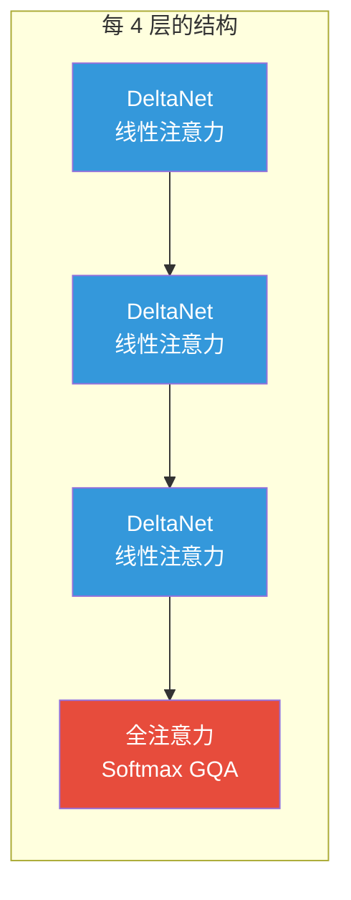
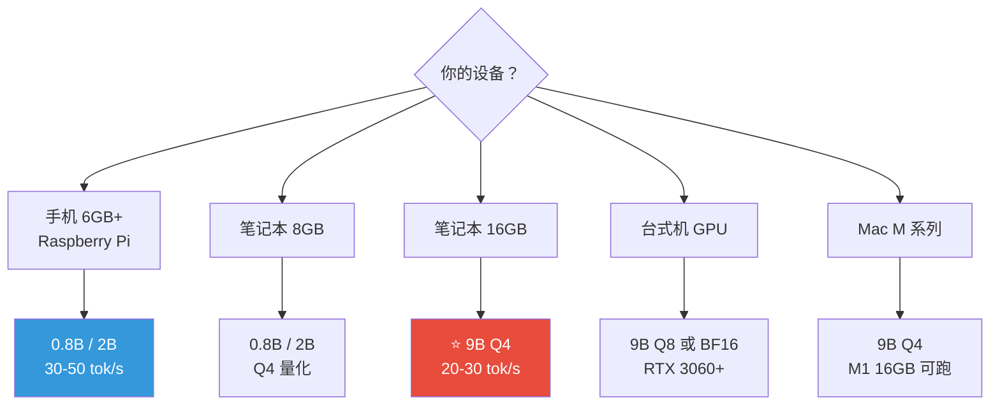

## 引言：小模型的逆袭

2026 年 3 月 2 日，阿里 Qwen 团队发布了 Qwen 3.5 小模型系列（0.8B / 2B / 4B / 9B），打破了"参数多才是好"的固有认知：

**Qwen 3.5-9B**（90 亿参数）在多项基准上超越了**GPT-OSS-120B**（1200 亿参数）——一个 **13 倍大**的模型：
- GPQA Diamond：**81.7%** vs 80.1%
- C-Eval：**88.2%** vs 76.2%
- MMMU-Pro（视觉推理）：**70.1%** vs 57.2%

更关键的是：**9B 模型可以在一台 16GB 笔记本上流畅运行**。

这意味着你可以**完全免费、完全离线、数据不出本机**地拥有一个接近一线水平的 AI 助手。

---

## 一、模型家族一览

| 参数 | Qwen3.5-0.8B | Qwen3.5-2B | Qwen3.5-4B | Qwen3.5-9B |
|------|-------------|-----------|-----------|-----------|
| **定位** | 手机/IoT | 手机/轻量 | 笔记本主力 | 桌面/笔记本旗舰 |
| **层数** | 24 | 24 | 32 | 32 |
| **上下文** | 262K | 262K | 262K (1M 扩展) | 262K (1M 扩展) |
| **多模态** | ✅ 图片+视频 | ✅ 图片+视频 | ✅ 图片+视频 | ✅ 图片+视频 |
| **思考模式** | 非思考 | 非思考 | ✅ 思考模式 | ✅ 思考模式 |
| **协议** | Apache 2.0 | Apache 2.0 | Apache 2.0 | Apache 2.0 |

### 架构亮点

Qwen 3.5 采用了创新的 **Gated DeltaNet 混合注意力**架构：



- **3:1 比例**：每 4 层中 3 层用 DeltaNet（线性复杂度，省内存），1 层用完整 Softmax 注意力（保证推理精度）
- **Multi-Token Prediction**：一次前向传播预测多个 Token，加速推理
- **DeepStack Vision Transformer**：Conv3d 补丁嵌入，0.8B 起就支持图片和视频理解
- **所有小模型都是密集模型**（非 MoE），更适合边缘设备部署

---

## 二、跑分实力

### 语言与推理

| 基准 | 0.8B | 2B | 4B | 9B | GPT-OSS-120B |
|------|------|-----|-----|-----|-------------|
| MMLU-Pro | 29.7 | 66.5 | 79.1 | **82.5** | 80.8 |
| C-Eval | 46.4 | 73.2 | 85.1 | **88.2** | 76.2 |
| GPQA Diamond | — | 51.6 | 76.2 | **81.7** | 80.1 |
| IFEval（指令跟随） | 52.1 | 61.2 | 89.8 | **91.5** | 88.9 |
| LongBench v2 | — | 38.7 | 50.0 | **55.2** | 48.2 |
| Agent (BFCL-V4) | — | — | 50.3 | **66.1** | — |

### 视觉与多模态

| 基准 | 9B | GPT-5-Nano | Gemini-2.5-Flash-Lite |
|------|-----|-----------|---------------------|
| MMMU-Pro | **70.1** | 57.2 | 59.7 |
| MathVision | **78.9** | 62.2 | 52.1 |
| VideoMME | **84.5** | 71.7 | 74.6 |
| OmniDocBench | **87.7** | — | — |
| MathVista | **85.7** | 71.5 | 72.8 |

**结论**：9B 在视觉推理上碾压同级别甚至更大的模型，MathVision 领先 Gemini Flash-Lite **26.8 个百分点**。

### Artificial Analysis 智能指数

| 模型 | 参数 | 得分 |
|------|------|------|
| **Qwen3.5-9B** | 9B | **32** |
| **Qwen3.5-4B** | 4B | **27** |
| Falcon-H1R-7B | 7B | 16 |
| NVIDIA Nemotron Nano 9B | 9B | 15 |
| Qwen3.5-2B | 2B | 16 |

9B 的得分是同级别竞品的 **2 倍**。

---

## 三、本地部署：3 种方案

### 方案 1：Ollama（最简单）

```bash
# 安装 Ollama（如未安装）
# macOS/Linux:
curl -fsSL https://ollama.com/install.sh | sh

# 运行模型（自动下载）
ollama run qwen3.5:0.8b    # 1.0 GB，手机级
ollama run qwen3.5:2b      # 2.7 GB，轻量级
ollama run qwen3.5:4b      # 3.4 GB，笔记本主力
ollama run qwen3.5:9b      # 6.6 GB，旗舰推荐
```

**启动 API 服务**（供编程工具调用）：
```bash
ollama serve  # 默认监听 http://localhost:11434
```

> **注意**：截至 2026 年 3 月，Ollama 对 Qwen 3.5 的多模态（视觉）支持不完整。文本推理完全正常，如需视觉功能请用方案 2。

### 方案 2：llama.cpp（推荐，完整多模态）

```bash
# 下载并运行（自动从 HuggingFace 拉取 GGUF）
./llama-cli \
  -hf unsloth/Qwen3.5-9B-GGUF:UD-Q4_K_XL \
  --ctx-size 16384

# 或启动 OpenAI 兼容 API 服务
./llama-server \
  -hf unsloth/Qwen3.5-9B-GGUF:UD-Q4_K_XL \
  --ctx-size 16384 \
  --port 8001
```

API 端点：`http://localhost:8001/v1/chat/completions`

### 方案 3：vLLM / SGLang（生产级）

```bash
# vLLM（完整多模态支持）
vllm serve Qwen/Qwen3.5-9B --port 8000

# SGLang
python -m sglang.launch_server \
  --model-path Qwen/Qwen3.5-9B \
  --port 30000
```

### 量化选择指南

| 量化 | 说明 | 9B 大小 | 质量损失 | 推荐场景 |
|------|------|---------|----------|----------|
| Q4_K_M | **标准 4-bit** | ~6.5 GB | 极小 | **大多数用户首选** |
| UD-Q4_K_XL | 动态 4-bit | ~6.5 GB | 更小 | 追求质量 |
| Q8_0 | 8-bit | ~13 GB | 几乎无 | 显存充足时 |
| BF16 | 全精度 | ~19 GB | 无 | 研究/基准测试 |
| UD-Q2_K_XL | 2-bit | ~4 GB | 中等 | 内存紧张 |

---

## 四、硬件选型



### 详细内存需求

| 模型 | 3-bit | **4-bit (Q4)** | 8-bit | BF16 |
|------|-------|----------------|-------|------|
| 0.8B | ~3 GB | ~3.5 GB | ~7.5 GB | ~9 GB |
| 2B | ~3 GB | ~3.5 GB | ~7.5 GB | ~9 GB |
| 4B | ~4.5 GB | ~5.5 GB | ~10 GB | ~14 GB |
| 9B | ~5.5 GB | **~6.5 GB** | ~13 GB | ~19 GB |

### 推理速度参考

| 设备 | 模型 | 量化 | 速度 |
|------|------|------|------|
| MacBook M1 16GB | 9B | Q4 | ~20-30 tok/s |
| MacBook M2 Pro 32GB | 9B | Q4 | ~30-40 tok/s |
| RTX 3060 12GB | 9B | Q4 | ~40-60 tok/s |
| RTX 4090 24GB | 9B | Q8 | ~80+ tok/s |
| iPhone（MLX） | 2B | Q4 | ~30-50 tok/s |

> **Mac 用户提示**：内存带宽是瓶颈，M3 Max 因更高带宽反而比 M4 Pro 更快。MLX 框架比 llama.cpp 快 20-30%。

---

## 五、接入编程工具

### Cline（VS Code 插件）

1. 确保 Ollama 或 llama-server 在运行
2. VS Code 安装 Cline 插件
3. Cline 设置中选择 **"OpenAI Compatible"**
4. 配置：
   - Base URL：`http://localhost:11434/v1`（Ollama）或 `http://localhost:8001/v1`（llama-server）
   - Model：`qwen3.5:9b`
   - Context Window：`16384`（或更大）
5. **启用 "Use compact prompt"**（关键！减少 90% 系统提示占用）

### Continue.dev（VS Code 插件）

在 `~/.continue/config.json` 中添加：

```json
{
  "models": [
    {
      "title": "Qwen 3.5 9B (Local)",
      "provider": "ollama",
      "model": "qwen3.5:9b",
      "apiBase": "http://localhost:11434"
    }
  ]
}
```

### 通用方案：任意支持 OpenAI API 的工具

只要工具支持自定义 API 地址，都可以接入：

```
Base URL: http://localhost:11434/v1  (Ollama)
          http://localhost:8001/v1  (llama-server)
          http://localhost:8000/v1  (vLLM)
API Key: 任意值（本地不验证）
Model:   qwen3.5:9b
```

适用于：Cline、Continue、OpenCode、Roo Code、Aider、TabbyML 等。

---

## 六、小模型横评

| 特性 | Qwen3.5-9B | Phi-4 (14B) | Gemma 3 (12B) | Llama 3.3 (8B) |
|------|-----------|------------|-------------|---------------|
| **参数** | 9B | 14B | 12B | 8B |
| **架构** | DeltaNet 混合 | 密集 Transformer | 密集 Transformer | 密集 Transformer |
| **多模态** | ✅ 图+视频 | ❌ 纯文本 | ✅ 图片 | ❌ 纯文本 |
| **上下文** | **262K (1M)** | 16K | 128K | 128K |
| **多语言** | **201 种** | ~100 种 | ~256K vocab | ~128K vocab |
| **协议** | Apache 2.0 | MIT | Apache 2.0 | Llama 社区 |
| **4-bit 大小** | ~6.5 GB | ~8 GB | ~7 GB | ~5 GB |
| **最佳场景** | 全能（推理+视觉+Agent） | STEM/数学 | Google 生态 | Meta 生态/微调 |

### 怎么选？

| 需求 | 推荐 | 原因 |
|------|------|------|
| **全能 + 视觉** | **Qwen3.5-9B** | 唯一同时支持图片、视频、262K 上下文的 sub-10B 模型 |
| 纯数学/代码 | Phi-4 | 合成数据训练，STEM 推理强 |
| Google 生态集成 | Gemma 3 | 原生适配 Android/TFLite |
| 最轻量/微调生态 | Llama 3.3 | 5GB 即可跑，微调社区最大 |
| 中文场景 | **Qwen3.5-9B** | 原生中文优化，C-Eval 88.2% |

---

## 七、实战：搭建本地 AI 编程助手

### 目标

在完全离线的环境下，用 Qwen3.5-9B 作为编程助手，实现代码补全、代码审查、Bug 修复。

### 步骤


**完整命令**：

```bash
# Step 1: 安装 Ollama
curl -fsSL https://ollama.com/install.sh | sh

# Step 2: 拉取模型（首次需下载 6.6GB）
ollama pull qwen3.5:9b

# Step 3: 启动服务
ollama serve

# Step 4: VS Code 安装 Cline 插件
# → 设置 Provider: OpenAI Compatible
# → Base URL: http://localhost:11434/v1
# → Model: qwen3.5:9b
# → 启用 compact prompt

# Step 5: 在 Cline 中输入指令，开始 AI 编程
```

### 效果预期

- **代码补全**：响应延迟 1-3 秒（16GB Mac，Q4）
- **代码解释**：可以理解并解释复杂代码逻辑
- **Bug 修复**：给出错误信息 + 代码片段，AI 能定位并修复
- **中文交互**：原生中文支持，无翻译延迟
- **图片理解**（llama.cpp）：截图 UI 让 AI 分析布局

### 局限性

- 复杂架构级重构不如 Claude Opus 4.6 或 GPT-5.4
- 生成速度比云端 API 慢（20-30 tok/s vs 100+ tok/s）
- 超长上下文（>16K）时速度明显下降

> **适合场景**：日常编程辅助、离线开发环境、敏感项目（数据不出本机）、学习和实验。
> **不适合场景**：大型项目全局重构、需要极速响应的生产环境。

---

## 八、注意事项

### 1. 幻觉率

Artificial Analysis 的测试显示 Qwen 3.5 小模型的幻觉率较高（80-82%），虽然提升主要来自"减少错误回答"而非"增加正确回答"。对于事实性查询，建议交叉验证。

### 2. 思考模式

4B 和 9B 默认启用思考模式（输出思考过程后给出答案），适合复杂推理但会增加延迟。关闭方法：
```
/set parameter num_predict 0  # Ollama 内
```
或在 API 调用中设置 `thinking: false`。

### 3. Ollama 多模态限制

截至 2026 年 3 月，Ollama 对 Qwen 3.5 的视觉功能支持不完整（mmproj 文件独立问题）。需要完整多模态功能请用 llama.cpp 或 vLLM。

### 4. 上下文窗口

默认 262K 上下文非常大。本地运行时建议限制在 **8K-32K**（通过 `--ctx-size` 参数），因为更大的上下文消耗更多内存且降低速度。仅在需要时扩展。

---

## 延伸阅读

- [DeepSeek 完全指南：本地部署到 Agent](/posts/deepseek-complete-guide/) — 另一个强大的国产开源模型
- [Ollama 本地大模型指南](/posts/ollama-local-llm-guide/) — Ollama 使用详解
- [国产大模型 API 选型实战](/posts/chinese-llm-api-guide-2026/) — 不想本地跑？用 API 更方便
- [Claude Code 终极指南](/posts/claude-code-tips/) — 云端 AI 编程的最佳体验
- [MCP 协议完全指南](/posts/mcp-protocol-guide/) — 让本地模型调用外部工具
