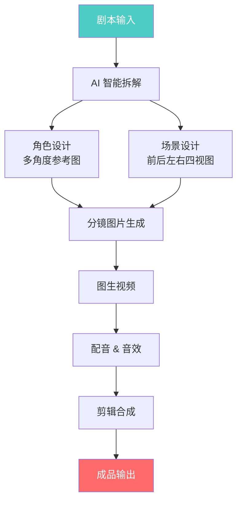
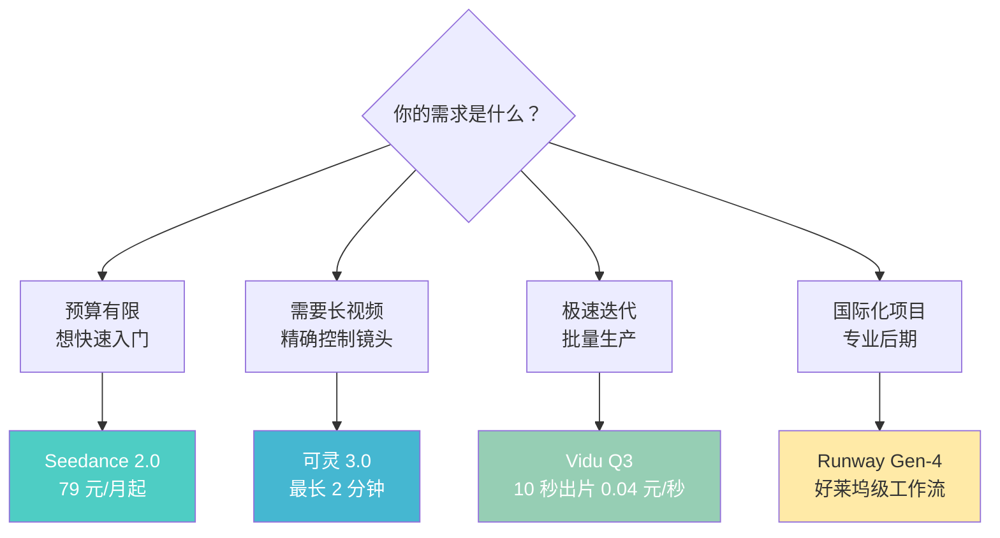
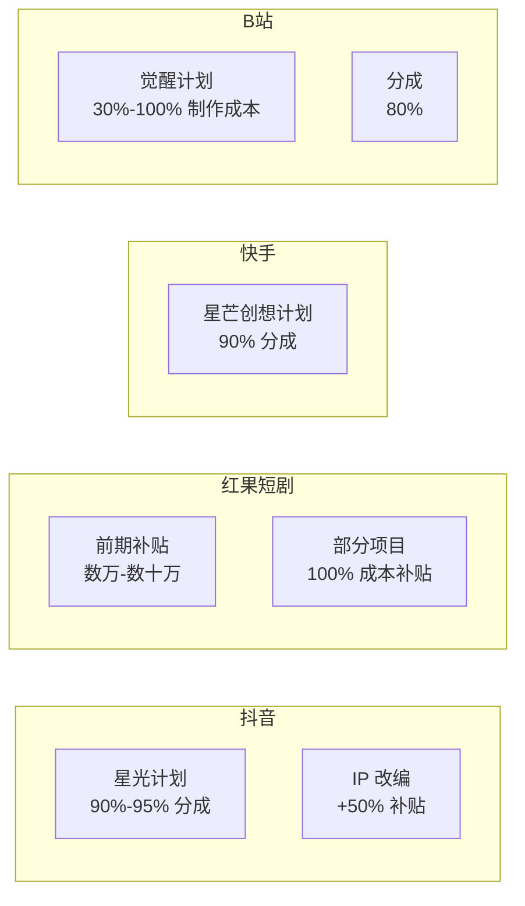
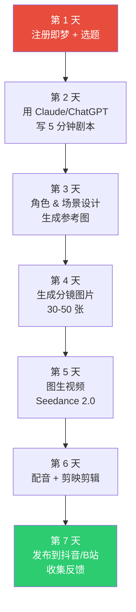

## 引言：一部 AI 短剧引发的行业地震

2026 年 2 月，一部名为《霍去病》的 AI 短剧横空出世——23 分钟的古装史诗、千军万马的战争场面、细腻的人物表情——**制作成本仅 3000 元，耗时 48 小时**，全网播放量突破 **5 亿**。

这不是科幻，这是 AI 视频生成技术在 2026 年的真实水平。

本文将从《霍去病》现象出发，**完整拆解** AI 短剧制作的全链路：核心工具 Seedance 2.0 的能力解析、7 步制作流程、6 大工具横评、以及 4 大平台的变现路径。

---

## 一、《霍去病》是怎么做出来的？

### 基本信息

| 项目 | 详情 |
|------|------|
| 创作者 | 杨涵涵AIGC |
| 时长 | 约 23 分钟 |
| 制作成本 | ~3000 元（AI 平台消耗） |
| 制作时间 | 48 小时 |
| 全网播放量 | 5 亿+ |
| 分发平台 | B 站、抖音、YouTube、微博 |

### 核心生产工具：纳米漫剧流水线

《霍去病》并非用单一 AI 工具制作，而是使用了 **360 集团的「纳米漫剧流水线」**（[namistory.com](https://www.namistory.com/)）——中国首个工业级 AI 漫剧智能体生产平台。

**什么是纳米漫剧？**

"纳米"取自"极小生产单元、极大产出规模"的理念：

- **极小**：5 人团队即可运转（AI 导演 + AI 抽卡师 + AI 后期）
- **极大**：产能达到传统 50 人团队水平，3 天可完成 120 分钟漫剧
- **极低**：83.5 元完成 59 个分镜，约 41 分钟

纳米漫剧流水线的核心技术是自研的**「纳米空间引擎」**——为角色、场景、道具创建 3D 空间一致性，解决了 AI 视频生成最大的痛点：**角色一致性**。



**关键数据**：该平台首次生成分镜通过率达 **90%**，远超行业平均的 30%-40%。

> **重要说明**：创作者杨涵涵在微博明确表示，《霍去病》在 Seedance 2.0 发布之前就已制作完成，使用的是纳米平台整合的早期模型（万相 2.6、即梦 4.5、Vidu Q3、可灵 O1）。但 Seedance 2.0 发布后，纳米平台已率先整合其完整版本，未来的 AI 短剧质量将进一步提升。

---

## 二、Seedance 2.0 深度解析

### 是什么？

Seedance 2.0 是**字节跳动 Seed 团队**开发的下一代多模态音视频联合生成模型，2026 年 2 月 12 日正式发布。它不只是"文字生成视频"，而是一个支持**文字 + 图片 + 视频 + 音频**多模态输入的全能创作引擎。

### 六大核心能力

#### 1. 多模态联合输入

同时支持输入：
- **9 张图片** + **3 段视频** + **3 段音频** + 自然语言指令
- 这意味着你可以提供角色参考图、场景视频、背景音乐，让 AI 综合理解后生成内容

#### 2. 15 秒多镜头输出

- 单次生成 **15 秒**高质量多镜头音视频
- 原生支持场景切换过渡，不需要手动拼接

#### 3. 原生双声道立体声

- 同步生成**背景音乐、环境音效、角色旁白**
- 精确匹配视觉节奏
- 这是其他工具（可灵、Runway、Pika）都没有的能力

#### 4. 物理精确性

- 花滑双人动作、格斗场景、布料模拟等复杂交互显著提升
- 减少了"AI 味"十足的物理穿帮

#### 5. 视频编辑与续写

- 可以编辑已生成视频中的特定片段、角色、动作
- 支持从最后一帧续写，实现长视频拼接

#### 6. 专业镜头语言

- 支持推拉摇移、跟踪、航拍等专业运镜
- 分辨率最高 1080p，可升级至 2K

### 访问方式

| 平台 | 地址 | 说明 |
|------|------|------|
| 即梦 Web | [jimeng.jianying.com](https://jimeng.jianying.com/ai-tool/home) | 中文界面，选择 Seedance 2.0 |
| Dreamina（国际版） | [dreamina.capcut.com](https://dreamina.capcut.com) | 英文界面 |
| 豆包 App | 手机应用商店搜索 | 对话中选择 Seedance 2.0 |
| 火山方舟 | 体验中心 | 开发者向 |
| API | 火山引擎 | 程序化调用 |

### 价格体系

| 方案 | 月费 | 说明 |
|------|------|------|
| 免费（即梦） | 0 元 | 每天 60-100 积分，约 1-2 次视频生成 |
| 免费（豆包） | 0 元 | 每天 10 次免费生成 |
| 基础会员 | 79 元/月 | 1080 积分/月，性价比最高 |
| 标准会员 | 更高档位 | 更多积分 + 优先队列 |
| API (720p) | ~0.65 元/秒 | 按使用量计费 |
| API (1080p) | ~2 元/秒 | 高分辨率 |

> **小贴士**：Seedance 2.0 发布后需求暴涨，闲鱼上标准会员月卡一度炒到 173 元。建议直接官方购买。

---

## 三、6 大 AI 视频生成工具横评

不同工具适合不同场景，以下是 2026 年 3 月最新对比：

| 维度 | Seedance 2.0 | 可灵 3.0 | Vidu Q3 | Sora 2 | Runway Gen-4 | Pika 2.5 |
|------|-------------|----------|---------|--------|-------------|----------|
| **开发商** | 字节跳动 | 快手 | 生数科技 | OpenAI | Runway | Pika Labs |
| **免费额度** | 60-100 积分/天 | 6 次/天 | 错峰无限 | 6 积分/天 | 125 次（一次性） | 80 积分 |
| **入门付费** | 79 元/月 | 30-100 元/月 | 有付费档 | $20/月 | $12/月 | $8/月 |
| **最长时长** | 15 秒 | **2 分钟** | 16 秒 | 25 秒 | ~10 秒 | 10 秒 |
| **最高分辨率** | 1080p (2K) | 1080p | 1080p | 1080p | 1080p | 1080p |
| **原生音频** | **双声道立体声** | 无 | **多语言对话** | 无 | 无 | 无 |
| **多模态输入** | **9 图+3 视频+3 音频** | 图+视频参考 | 图+参考 | 图 | 图 | 图 |
| **中文支持** | 原生 | 原生 | 原生 | 有限 | 无 | 无 |
| **需要翻墙** | 否 | 否 | 否 | **是** | **是** | **是** |

### 选择建议



**核心结论**：
- **性价比之王**：Seedance 2.0（多模态输入 + 原生音频 + 最低价格）
- **长视频首选**：可灵 3.0（独家支持 2 分钟连续视频）
- **极速批量生产**：Vidu Q3（10 秒出片、0.04 元/秒、错峰免费无限用）
- **专业影视后期**：Runway Gen-4（好莱坞级工具链集成）

---

## 四、AI 短剧制作 7 步全流程


### Step 1：剧本创作

**推荐工具**：ChatGPT / Claude / 豆包 / 通义千问

**要点**：
- 先确定故事类型：悬疑、爱情、古装、科幻
- 给 AI 一个清晰的大纲，让它扩展完整剧本
- 包含场景描述、角色对话、情绪节拍

**Prompt 示例**：
```
你是一个专业的短剧编剧。请为我创作一个 10 分钟的古装悬疑短剧剧本。
要求：
1. 主角是一个女神探
2. 故事发生在唐朝长安
3. 包含 3 个反转
4. 分为 8 个场景，每个场景注明：场景描述、角色、对话、镜头建议
```

### Step 2：剧本拆解 & 分镜生成

**推荐工具**：纳米漫剧流水线 / Coze 工作流 / 手动 Prompt

将剧本转化为逐镜头的拍摄指令：

| 镜号 | 场景 | 角色 | 动作描述 | 镜头 | 对话/旁白 |
|------|------|------|----------|------|-----------|
| 01 | 长安城门-日 | 女主 | 骑马入城，俯瞰全景 | 航拍推进 | （旁白）大唐贞观年间... |
| 02 | 城门特写 | 女主 | 勒马停驻，回头凝视 | 中景→特写 | "此案，必有蹊跷" |

### Step 3：角色 & 场景设计

**推荐工具**：Midjourney / Stable Diffusion / 万相 / 即梦 AI

**关键要点**：
- 为每个角色创建**多角度参考图**（正面、侧面、背面）
- 为每个场景创建**四视图**（前、后、左、右）
- **锁定外观细节**：服装颜色、发型、配饰、体型
- 这一步决定了全片的**角色一致性**，是最重要的前期工作

### Step 4：分镜图片生成

**推荐工具**：即梦 AI / 可灵 / Midjourney / 万相

将每个分镜描述 + 角色参考图输入 AI，生成高质量静态画面：

```
参考图：[角色正面照]
场景：唐朝长安城门前，黄昏时分
角色动作：女主骑白马，身着红色披风，回头凝视
镜头：中景，45度仰角
光线：暖色调，夕阳逆光
```

**常见问题与解决**：
- **角色不一致**：使用参考图 + 详细描述约束
- **"大头贴"问题**：变换镜头角度（远景、中景、特写交替）
- **画面塑料感**：强调光影细节，增加画面层次

### Step 5：图生视频

**推荐工具**：Seedance 2.0 / 可灵 / Vidu

这一步将静态分镜变成动态视频：

```
输入图片：[分镜画面]
运动指令：角色缓慢回头，披风随风飘动
镜头运动：缓慢推进，从中景到特写
时长：5 秒
```

**最佳实践**：
- 明确指定镜头运动方式（推、拉、摇、移、跟）
- 每个镜头 3-8 秒最佳，太长容易变形
- Seedance 2.0 支持 15 秒多镜头一次生成

### Step 6：配音 & 音效

**推荐工具**：

| 用途 | 工具 | 说明 |
|------|------|------|
| 角色配音 | Fish Audio / Eleven Labs | 克隆音色或选择预设 |
| 旁白 | 火山语音 / ChatTTS | 中文效果好 |
| 背景音乐 | Suno / Udio | AI 生成配乐 |
| 原生音频 | Seedance 2.0 | 视频+音频同步生成 |

### Step 7：剪辑合成

**推荐工具**：剪映（CapCut）/ Premiere Pro / DaVinci Resolve

- 按分镜顺序拼接所有视频片段
- 添加过渡效果和字幕
- 叠加音轨（对话、音效、音乐）
- 调色统一全片色调
- 添加片头片尾

---

## 五、AI 短剧变现：4 大平台全攻略

AI 短剧不只是技术玩具，它已经是一门**可观的生意**。2025 年中国微短剧行业规模接近 **9000 亿元**，同比翻倍增长。

### 平台分成对比



### 详细变现路径

#### 1. 抖音（最高收入潜力）

- **星光计划 / 辰星计划**：给创作者 **90%-95%** 的分账收入
- **IP 改编项目**：额外 50% 补贴
- **单部爆款收入**：头部可达 **600 万元**
- **受众**：30 岁以下占 70% 以上

#### 2. 红果短剧（字节系）

- 对优质剧本提供**数万到数十万元**的前期补贴
- 部分项目平台承担 **100% 制作成本**
- 与抖音信息流联动分发

#### 3. 快手

- **星芒创想计划**：鼓励 AI 工具使用
- 联合运营模式最高 **90% 分成**
- 支持 IAAP（付费+充值）、IAA（广告+支付）、品牌合作、IP 衍生、海外出口

#### 4. B 站

- **觉醒计划**：覆盖 **30%-100% 制作成本**
- 最高 **80% 分成**
- 二次元、动漫风格内容天然适配

#### 5. 爱奇艺

- 独家新内容：会员激励分账最高 **100%**
- 剧本合作：单个剧本 **5 万元以上** + 播后分成

### 收入预期参考

| 案例 | 制作成本 | 收入 | 周期 |
|------|----------|------|------|
| 《霍去病》 | ~3000 元 | 流量收益（5 亿播放） | 2 周 |
| 《兴安岭诡事》| ~60 万元 | 30 万元+（抖音 9 天） | 9 天 |
| 头部创作者合作 | 团队协作 | 600 万元 | 单部 |

**AI 短剧 vs 传统短剧**：
- 成本降低 **80%-90%**
- 制作周期缩短 **50%+**
- 部分品类净利润率超过 **50%**

---

## 六、5 个避坑指南

### 1. 角色一致性是生命线

AI 视频生成最大的问题就是角色"变脸"。解决方法：
- 前期花足够时间做角色参考图（多角度、多表情）
- 使用纳米漫剧等带有空间引擎的平台
- 每生成一批画面就检查一致性

### 2. 避免"大头贴"式构图

新手常犯的错误是每个镜头都是正面中景。专业做法：
- 远景→中景→特写交替使用
- 加入俯拍、仰拍、侧面等角度
- 运动镜头（推拉摇移）让画面活起来

### 3. 音频决定 60% 的观感

一段没有声音的 AI 视频看起来像 PPT。务必做好：
- 角色对话配音
- 环境音效（风声、马蹄声、人群声）
- 背景音乐匹配情绪节拍

### 4. 不要跨太多工具

在 5 个工具之间跳来跳去会严重破坏角色一致性和效率。建议：
- 主力工具选 1 个（Seedance / 可灵 / Vidu）
- 辅助工具选 1-2 个
- 或直接用纳米漫剧这类集成平台

### 5. 先做 3 分钟验证

不要一上来就做 20 分钟长片。先做一个 3 分钟的 Demo：
- 验证角色一致性方案
- 测试工具组合效果
- 评估实际时间和成本消耗
- 发到平台测试观众反应

---

## 七、新手快速起步路线



**一周出片**的关键：
1. 选题选热门、有情绪共鸣的题材
2. 第一部先追求"完成"，不追求"完美"
3. 用免费额度验证流程，再考虑付费
4. 根据平台反馈快速迭代第二部

---

## 八、行业展望

AI 短剧正处于**爆发前夜**：

- **技术端**：Seedance 2.0、可灵 3.0、Vidu Q3 三强竞争，视频质量每季度都在跨代提升
- **内容端**：从"AI 生成的炫技"转向"真正好看的故事"，内容为王的时代正在到来
- **商业端**：平台补贴力度空前（红果 100% 补贴、B 站觉醒计划），现在是入场的最佳窗口期
- **门槛端**：纳米漫剧等工业化平台让个人创作者也能产出影视级内容

**核心观点**：AI 短剧的竞争最终不在工具，而在**故事和运营**。工具在拉平技术门槛，真正的壁垒是选题洞察、叙事能力、和平台运营策略。

---

## 延伸阅读

- [2026 年 10 个最值得用的 AI 工具](/posts/top-10-ai-tools-2026/) — 覆盖更多 AI 生产力工具
- [AI Agent 赚钱变现：2026 年 9 种已验证的方法](/posts/ai-agent-monetization/) — AI 内容创作之外的更多变现思路
- [程序员转型 AI：2026 年完整学习路径](/posts/programmer-ai-learning-path/) — 从零开始学 AI 的系统路线
- [Vibe Coding 完全指南](/posts/vibe-coding-guide/) — 用 AI 辅助编程提升效率
